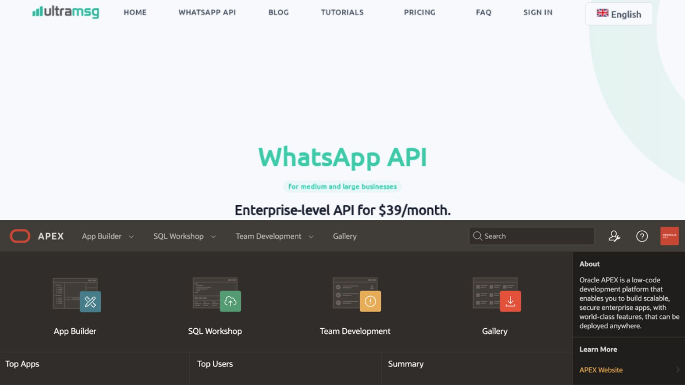
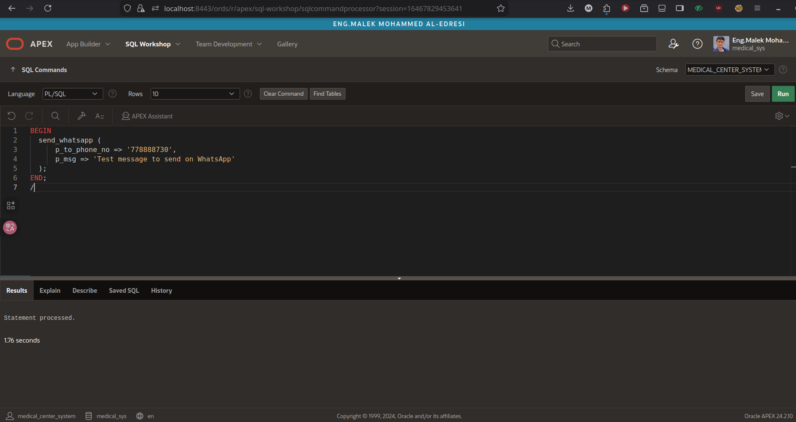

---

# Oracle APEX + UltraMsg WhatsApp API Integration

This project demonstrates how to integrate **UltraMsg WhatsApp API** with **Oracle APEX / Oracle Database (PL/SQL)** to send WhatsApp messages programmatically.
It includes example SQL scripts, a stored procedure for sending WhatsApp messages, configuration steps, and sample usage.

---
 

| Procedure Code | Run Preview |
|----------------|-------------|
|  |  |

---


## Features

* Send WhatsApp messages directly from Oracle Database using UltraMsg API
* Ready-to-use `PL/SQL` procedure for message sending
* Works with **Oracle APEX** and **Autonomous Database**
* Simple configuration & customizable message body
* Example SQL script included
* Dynamic API configuration retrieval from database tables
* Proper error handling and logging
* Secure credential management

---

## Project Structure

```
oracle-apex-ultramsg-whatsapp-integration/
├── README.md                     # Documentation
├── script.sql                    # UltraMsg WhatsApp procedure + test example
└── screenshot/
    └── procedure.png             # Screenshot of PL/SQL procedure
    └── message.jpg               # Screenshot of message output
```

---

## Requirements

| Component          | Version                             |
| ------------------ | ----------------------------------- |
| Oracle Database    | 12c or higher (19c recommended)     |
| Oracle APEX        | Optional (for UI integration)       |
| UltraMsg Account   | With API Credentials                |
| Network ACL/Wallet | Required for HTTPS outbound request |
| Configuration Table| MANAG_SYS_SEC_L_SETTING_API_SERVICES|

---

## Setup Instructions

### 1. Get UltraMsg Credentials

From UltraMsg Console:

```
INSTANCE_ID
TOKEN
API_HOST
API_URL
COUNTRY_CODE
```

---

### 2. Configure API Settings Table

Ensure the configuration table exists with your UltraMsg credentials:

```sql
-- Example configuration table structure
CREATE TABLE MANAG_SYS_SEC_L_SETTING_API_SERVICES (
    SERVICE_NAME VARCHAR2(100),
    API_KEY VARCHAR2(255),
    ACCOUNT_SID VARCHAR2(255),
    API_HOST VARCHAR2(255),
    API_URL VARCHAR2(255),
    CODE_COUNTRY_CALL VARCHAR2(20)
);

-- Insert UltraMsg configuration
INSERT INTO MANAG_SYS_SEC_L_SETTING_API_SERVICES (
    SERVICE_NAME,
    API_KEY,
    ACCOUNT_SID,
    API_HOST,
    API_URL,
    CODE_COUNTRY_CALL
) VALUES (
    'ULTAR_MESSAGE_WHTASAPP',
    'your_token_here',
    'your_instance_id_here',
    'https://api.ultramsg.com',
    '/messages/chat',
    '967'  -- Example: Yemen country code
);
COMMIT;
```

---

### 3. Create Procedure Inside Oracle

Import `script.sql` or create manually.

Example structure:

```sql
create or replace procedure send_whatsapp(
    p_to_phone_no IN VARCHAR2,
    p_msg         IN CLOB
) is
    ...
end;
/
```

---

### 4. Test WhatsApp Message Sending

```sql
BEGIN
    send_whatsapp(
        p_to_phone_no => '778888730',
        p_msg         => 'Test message to send on WhatsApp'
    );
END;
/
```

---

## APEX Integration Example

You may call the procedure after button click or dynamic action:

```plsql
BEGIN
    send_whatsapp(:P0_PHONE, :P0_MESSAGE);
END;
/
```

---

## Security Notes

* Do not publish **API Token** publicly
* Use **APEX Credential Store / Vault** for production
* Ensure network access to `api.ultramsg.com`
* Store credentials in database tables or vault for production use
* Validate phone numbers and message content before sending
* Implement proper input validation and security checks
